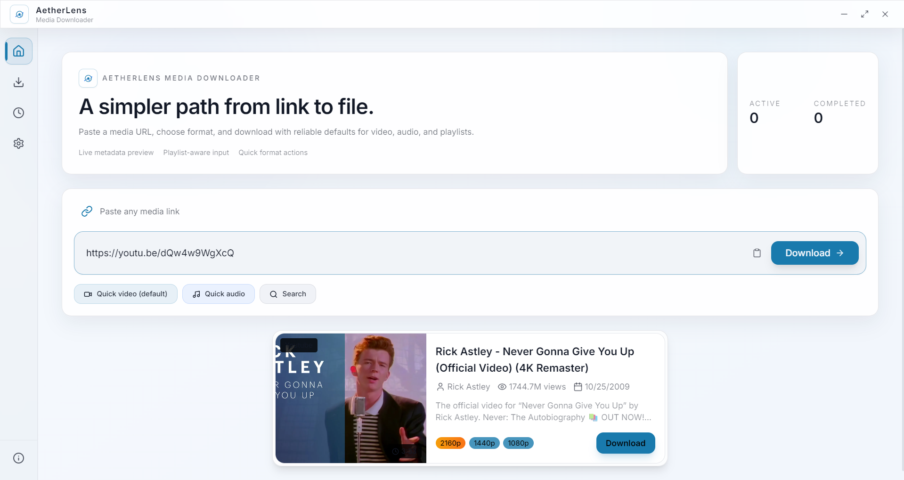
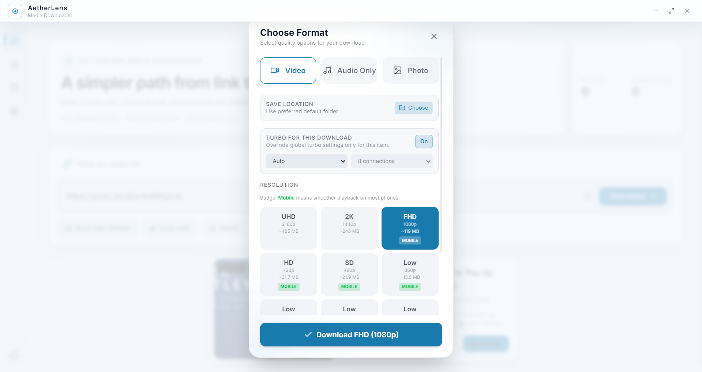
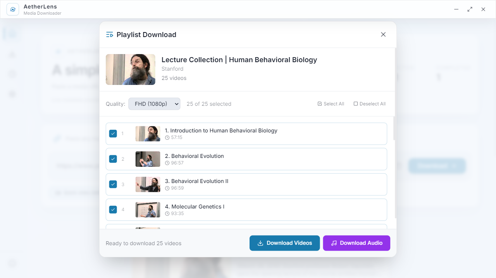
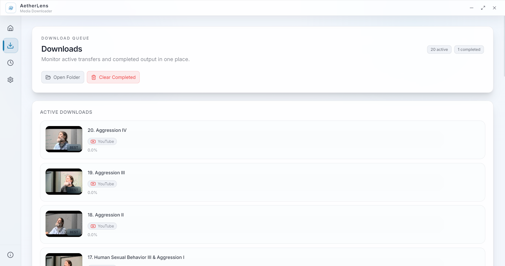

# AetherLens Media Downloader

A cross-platform desktop app for downloading and organizing media. Paste a URL, pick a format, manage everything from one queue.

Built with **Electron**, **React**, **TypeScript**, and **yt-dlp**.

<br>

<p align="center">
  <a href="https://samuellchang.github.io/aetherlens-media-downloader/download/">
    
  </a>
</p>

<p align="center">
  <a href="https://samuellchang.github.io/aetherlens-media-downloader/download/">samuellchang.github.io/aetherlens-media-downloader</a>
  &nbsp;·&nbsp;
  <a href="https://github.com/SamuelLChang/aetherlens-media-downloader/releases">Releases</a>
  &nbsp;·&nbsp;
  <a href="#quick-start">Dev Setup</a>
</p>

<br>

> **Easiest way to install:** visit the [download page](https://samuellchang.github.io/aetherlens-media-downloader/download/), pick your platform (`.exe` / `.dmg` / `.AppImage`), and run the installer.

---

## Screenshots

| Home & URL Preview | Format Selector |
|---|---|
|  |  |

| Playlist Batch | Downloads Queue |
|---|---|
|  |  |

---

## Features

| | |
|---|---|
| **URL metadata preview** | See title, duration, and formats before downloading |
| **Format & quality control** | Pick audio/video profiles — no guessing |
| **Playlist & batch support** | Select specific items from channels and playlists |
| **Queue management** | Pause, resume, retry, cancel — all in one screen |
| **Setup wizard** | First-run flow handles dependencies automatically |
| **Persistent history** | Past downloads and settings stick between sessions |

---

## How It Works

```
1. Paste a media URL
2. Review metadata and available formats
3. Select format, quality, and destination
4. Start download → manage from the queue
```

---

## Quick Start

```bash
git clone https://github.com/SamuelLChang/aetherlens-media-downloader.git
cd aetherlens-media-downloader
npm install
npm run dev
```

On first launch the setup wizard checks for `yt-dlp`, `ffmpeg`, and `aria2c` and shows install commands for anything missing.

---

## Installer Downloads

You don't need to clone or build locally — just grab an installer:

| Platform | Format | Link |
|---|---|---|
| **Windows** | `.exe` setup wizard | [Download page](https://samuellchang.github.io/aetherlens-media-downloader/download/) |
| **macOS** | `.dmg` disk image | [Download page](https://samuellchang.github.io/aetherlens-media-downloader/download/) |
| **Linux** | `.AppImage` portable | [Download page](https://samuellchang.github.io/aetherlens-media-downloader/download/) |

All binaries: [GitHub Releases](https://github.com/SamuelLChang/aetherlens-media-downloader/releases)

### About OS security warnings

AetherLens is open-source and not commercially code-signed. Windows SmartScreen and macOS Gatekeeper may show a warning — this is a signing cost issue, not a safety issue.

- **Windows:** click *More info → Run anyway*
- **macOS:** go to *System Settings → Privacy → Open Anyway*

To verify: review the source, compare release tags, download only from this repo or the official website.

### How releases are published

1. Push a version tag (e.g. `v0.2.0`)
2. GitHub Actions builds installers for all platforms
3. Artifacts are uploaded to a GitHub Release automatically
4. The [download page](https://samuellchang.github.io/aetherlens-media-downloader/download/) pulls from the latest release

<details>
<summary>Enable GitHub Pages (one-time repo setup)</summary>

1. Open repository **Settings → Pages**
2. Source: **Deploy from a branch**
3. Branch: `main`, folder: `/docs`
4. Save — then visit `/download/` under your Pages URL

</details>

---

## Installation From Source

### 1. Install dependencies

<details>
<summary>Windows (PowerShell)</summary>

```powershell
winget install OpenJS.NodeJS.LTS
winget install yt-dlp.yt-dlp
winget install Gyan.FFmpeg
winget install aria2.aria2
```
</details>

<details>
<summary>macOS (Homebrew)</summary>

```bash
brew install node yt-dlp ffmpeg aria2
```
</details>

<details>
<summary>Linux (Debian/Ubuntu)</summary>

```bash
sudo apt update && sudo apt install -y nodejs npm yt-dlp ffmpeg aria2
```
</details>

<details>
<summary>Linux (Fedora)</summary>

```bash
sudo dnf install -y nodejs npm yt-dlp ffmpeg aria2
```
</details>

<details>
<summary>Linux (Arch)</summary>

```bash
sudo pacman -S --needed nodejs npm yt-dlp ffmpeg aria2
```
</details>

### 2. Verify

```bash
node --version && npm --version && yt-dlp --version
```

`ffmpeg` and `aria2c` are optional but recommended.

### 3. Clone, install, run

```bash
git clone https://github.com/SamuelLChang/aetherlens-media-downloader.git
cd aetherlens-media-downloader
npm install
npm run dev
```

### 4. Build installer

```bash
npm run build
```

Optional — bundle local `aria2c`:
```bash
npm run build:with-bundled-aria2
```

---

## System Requirements

- Node.js 18+ / npm 9+
- `yt-dlp` on `PATH` (required)
- `ffmpeg` (optional — for merge/conversion)
- `aria2c` (optional — for download acceleration)

See [`SYSTEM_REQUIREMENTS.md`](SYSTEM_REQUIREMENTS.md) for details.

---

## Scripts

| Command | Description |
|---|---|
| `npm run dev` | Run in development mode |
| `npm run build` | Compile + package with Electron Builder |
| `npm run build:with-bundled-aria2` | Bundle `aria2c` then build |
| `npm run prepare:aria2` | Best-effort bundle of local `aria2c` |
| `npm run lint` | Run ESLint |
| `npm run preview` | Preview renderer build |

---

## Developer API

Renderer ↔ main process communication goes through `window.electronAPI` (defined in `electron/preload.ts`).

<details>
<summary>Key IPC methods</summary>

| Method | Purpose |
|---|---|
| `getVideoInfo(url, cookiesBrowser?)` | Fetch video metadata |
| `startDownload(options)` | Start a download job |
| `pauseDownload(id)` / `resumeDownload(id)` | Pause/resume |
| `cancelDownload(id)` | Cancel a job |
| `getPlaylistInfo(url)` | Fetch playlist metadata |
| `searchVideos(query, platform, count)` | Search for videos |
| `getDownloadLocation()` / `selectDownloadLocation()` | Manage output path |
| `getAvailableBrowsers()` / `validateBrowserCookies(browser)` | Cookie browser support |

Extend by adding IPC handlers in `electron/main.ts` and exposing safe methods through preload.

</details>

---

## Project Structure

```
src/            React renderer
electron/       Electron main + preload
scripts/        Build-time helper scripts
build/icons/    Packaging icons
bin/            Optional runtime binaries
docs/           GitHub Pages website + screenshots
```

---

## Legal

MIT License — see [`LICENSE`](LICENSE).

This project is for **lawful use only**. Users are responsible for compliance with copyright law, local regulations, and platform terms of service.

See also: [`LEGAL.md`](LEGAL.md) · [`THIRD_PARTY_NOTICES.md`](THIRD_PARTY_NOTICES.md)
