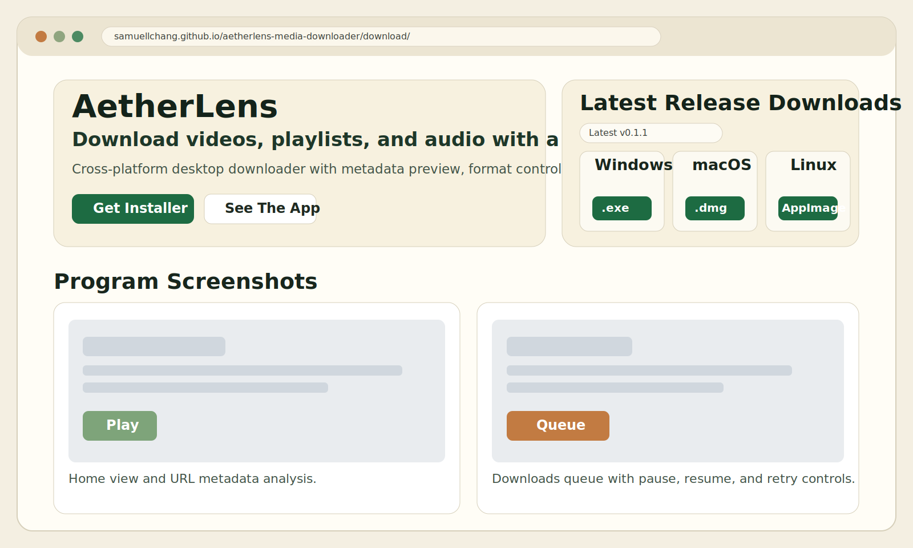
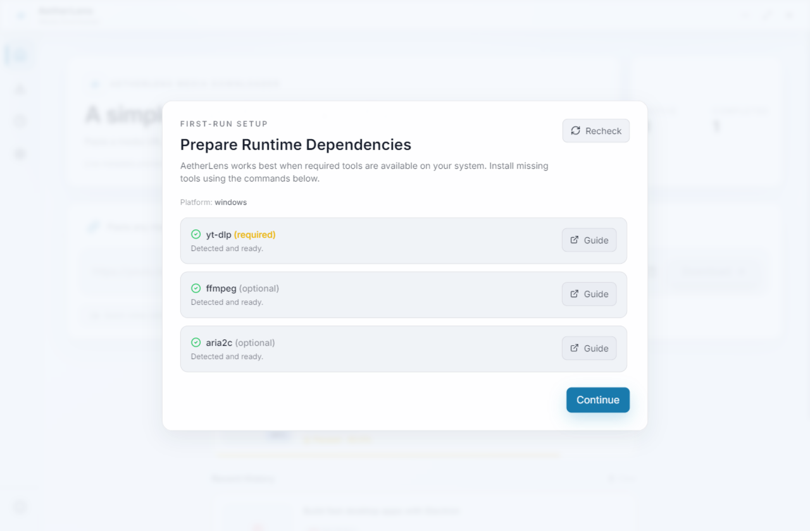

# AetherLens Media Downloader

AetherLens is a cross-platform desktop app for downloading and organizing media with a clean, task-focused workflow.

Built with Electron, React, and TypeScript, it is designed to make advanced download operations feel simple: paste a URL, inspect metadata, choose quality, and track every job from one place.


## Download From Website (Recommended)

For most users, the easiest path is the public download website:

- Website: `https://samuellchang.github.io/aetherlens-media-downloader/`
- Direct download page: `https://samuellchang.github.io/aetherlens-media-downloader/download/`

Open the website, choose your platform installer (`.exe`, `.dmg`, `.AppImage`), and install using the setup wizard.



### Important Safety Note About OS Warnings

Because AetherLens is open source and currently distributed without a paid commercial code-signing certificate, Windows SmartScreen and macOS Gatekeeper may show a safety warning.

This warning does **not** automatically mean the installer is malicious. It usually means the app is unsigned or newly distributed.

If you want to verify before installing:

1. Review the source code in this repository.
2. Download installers only from the official website/release links above.
3. Compare release tags, commit history, and release assets in GitHub.

Official releases page:

- `https://github.com/SamuelLChang/aetherlens-media-downloader/releases`

## Why AetherLens

- Fast metadata preview before downloading
- Format and quality control for video, audio, and image flows
- Playlist and channel-style batch handling
- Queue controls with pause, resume, retry, and cancel
- Setup wizard for dependency checks and guided install commands
- Local history and settings persistence

## Product Tour

All screenshots below are real in-app captures stored as `.png` files.

### First-Run Setup Wizard



On first launch, AetherLens checks required/optional runtime tools (`yt-dlp`, `ffmpeg`, `aria2c`) and shows one-click copy commands for missing tools.

### Home And URL Preview


Paste any supported media URL to fetch title, duration, source metadata, and available formats before starting.

### Format And Quality Selection


Choose output type, quality level, and destination behavior. This keeps downloads predictable and avoids re-runs.

### Playlist Workflow


For playlist-style URLs, AetherLens helps you review items and run batch downloads with better control over what gets queued.

### Downloads Queue


Track active and completed jobs with progress information and controls for pause, resume, retry, and cancel.

## How It Works

1. Paste a media URL.
2. Review metadata and available formats.
3. Select format, quality, and target location.
4. Start download and monitor progress.
5. Manage queue operations from the Downloads page.

## Quick Start

```bash
npm install
npm run dev
```

## One-Click Installer Downloads

You do not need to clone/build locally once releases are published.

- Download page: `https://samuellchang.github.io/aetherlens-media-downloader/download/`
- Full releases: `https://github.com/SamuelLChang/aetherlens-media-downloader/releases`

How publishing works:

1. Push a version tag like `v0.2.0`.
2. GitHub Actions builds Windows, macOS, and Linux installers.
3. The workflow uploads all installers to a GitHub Release automatically.
4. The download page reads the latest release and shows direct platform buttons.

### Enable GitHub Pages (one-time)

1. Open repository `Settings` -> `Pages`.
2. Source: `Deploy from a branch`.
3. Branch: `main`, folder: `/docs`.
4. Save, then open `/download/` under your Pages URL.

## Installation Guide (Step By Step)

This section is designed for first-time users. If you follow the steps in order, the app should run without extra troubleshooting.

### 1. Install Required Tools

`yt-dlp` is required. `ffmpeg` and `aria2c` are optional but strongly recommended.

Windows (PowerShell):

```powershell
winget install OpenJS.NodeJS.LTS
winget install yt-dlp.yt-dlp
winget install Gyan.FFmpeg
winget install aria2.aria2
```

macOS (Homebrew):

```bash
brew install node yt-dlp ffmpeg aria2
```

Linux examples:

Debian/Ubuntu:

```bash
sudo apt update
sudo apt install -y nodejs npm yt-dlp ffmpeg aria2
```

Fedora:

```bash
sudo dnf install -y nodejs npm yt-dlp ffmpeg aria2
```

Arch:

```bash
sudo pacman -S --needed nodejs npm yt-dlp ffmpeg aria2
```

### 2. Verify Tool Installation

Run:

```bash
node --version
npm --version
yt-dlp --version
ffmpeg -version
aria2c --version
```

Notes:

- `yt-dlp` must work.
- `ffmpeg` and `aria2c` may be missing if you only want basic downloads.

### 3. Clone The Project

```bash
git clone https://github.com/SamuelLChang/aetherlens-media-downloader.git
cd aetherlens-media-downloader
```

### 4. Install JavaScript Dependencies

```bash
npm install
```

### 5. Run The App (Development)

```bash
npm run dev
```

What to expect on first run:

1. The setup wizard opens automatically.
2. Missing tools are marked as "Not found on PATH".
3. Use "Copy command" and install missing items.
4. Click "Recheck" in the wizard.
5. Continue when required tools are detected.

### 6. Build A Desktop Installer

```bash
npm run build
```

This generates packaged artifacts with Electron Builder.

### 7. Optional: Bundle Local `aria2c`

If you want to package with a local `aria2c` binary (when available on your machine):

```bash
npm run build:with-bundled-aria2
```

## System Requirements

- Node.js 18+
- npm 9+
- `yt-dlp` available on system `PATH`
- Optional: `ffmpeg` for merge/conversion workflows
- Optional: `aria2c` for acceleration

For platform-specific commands, see `SYSTEM_REQUIREMENTS.md`.

## Build And Package

```bash
npm run build
```

Notes:

- Default builds do not bundle third-party helper binaries.
- If `aria2c` is available on `PATH`, the app can use it at runtime.
- Optional helper bundling: `npm run build:with-bundled-aria2`.

## Scripts

- `npm run dev`: run renderer and Electron in development mode
- `npm run prepare:aria2`: best-effort bundle of local `aria2c` from `PATH`
- `npm run build`: compile and package with Electron Builder
- `npm run build:with-bundled-aria2`: bundle `aria2c` then build
- `npm run lint`: run ESLint
- `npm run preview`: preview renderer build

## Developer Integration

Renderer-to-main APIs are exposed through `window.electronAPI` in `electron/preload.ts`.

Key integration methods:

- `getVideoInfo(url, cookiesBrowser?)`
- `startDownload(options)`
- `pauseDownload(id)`
- `resumeDownload(id)`
- `cancelDownload(id)`
- `getPlaylistInfo(url)`
- `searchVideos(query, platform, count)`
- `getDownloadLocation()`
- `selectDownloadLocation()`
- `getAvailableBrowsers()`
- `validateBrowserCookies(browser)`

If you extend behavior, add IPC handlers in `electron/main.ts` and expose minimal safe methods through preload.

## Project Structure

- `src/`: React renderer
- `electron/`: Electron main and preload process
- `scripts/`: helper scripts for build-time tasks
- `build/icons/`: packaging icons
- `bin/`: optional runtime helper binaries
- `docs/screenshots/`: README visual assets

## Legal And Compliance

- License: MIT (`LICENSE`)
- This project is for lawful use only
- Users are responsible for compliance with copyright law, local regulations, and platform terms

Additional references:

- `LEGAL.md`
- `THIRD_PARTY_NOTICES.md`
